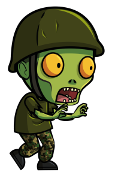

# CryptoZombies
This project serves as an introduction to Solidity programming language in a game based environment. 
The final contract interacts with existing contract of `CryptoKitties` and supports multiple users. 



## Using Pre-Built Contracts
1. ERC721 is used for handling tokens.  `http://erc721.org`
2. Ownable provides a function modifier. `openzeppelin-solidity`
3. SafeMath provides a framework for handling safe math operations (overflow, underflow). `openzeppelin-solidity`

## Basic Zombie Object
```
  struct Zombie {
    string name;
    uint dna;
    uint32 level;
    uint32 readyTime;
    uint16 winCount;
    uint16 lossCount;
  }
```
## Interactions
The goal of a zombie is to feed and multiply, thus these functions where implemented:
```
1. function feedAndMultiply(uint _zombieId, uint _targetDna, string _species) internal onlyOwnerOf(_zombieId)
2. function feedOnKitty(uint _zombieId, uint _kittyId) public
3. function attack(uint _zombieId, uint _targetId) external onlyOwnerOf(_zombieId)
```

